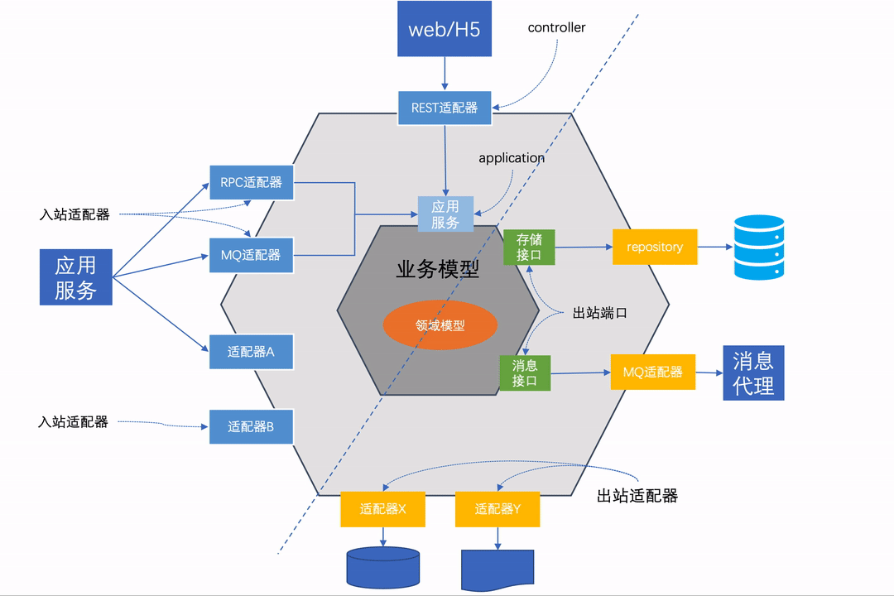
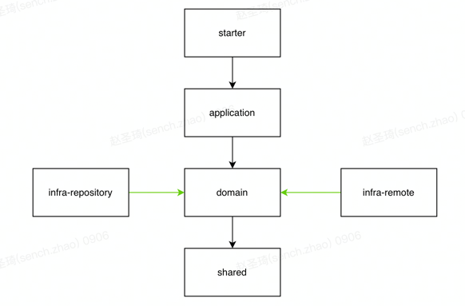
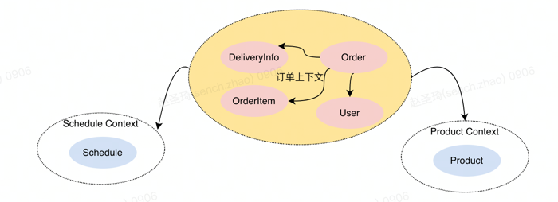

# ddd-order-demo

> DDD是手段不是目的，我们的目的是让业务==编码。


# 六边形架构



**关键术语**
- 领域：相对于限界上下文，“领域”属于问题空间的概念项目；例如：CRM是一个领域，但是具体到工程项目，可以分为企业CRM、用户CRM。在DDD中，一个领域可以分为多个子域，领域模型在限界上下文中完成开发；在开发一个领域模型时，我们关注的通常只是这个业务系统的某一个方面。
- 子域：在本篇中，领域与子域的概念可以认为是一致的，因为在本篇我们只关心一个业务系统（就是后面的示例订单系统）
- 限界上下文：说白了，限界上下文就是idea里的一个实体工程项目。在项目初期，可能整个公司只有一个限界上下文（也就是我们常说的单体架构），随着规模和用户体量的不断扩大，项目就需要拆分多个限界上下文（也就是我们所说的服务拆分），那么如何拆分，按照什么规则、什么大小拆分才是合理的？这就是DDD战略设计所做的事情（本篇我们只讲战术设计，不多介绍战略设计）。
- 领域模型：
- 数据模型：
- 资源库：
- 聚合和聚合根：
-

# 编码实战
## 架构


## 模块介绍
- starter：启动器/用户界面层；如：controller、provider、task、consumer
    - 这里的做法是把starter启动器和用户界面层整合到一起。其它做法：单独一层只放springboot的启动器和加载相关组件，但需要独立出一层用户界面层（因为starter和用户界面层比较轻，所以可以整合为一层）
- application：应用服务层，对应传统分层架构的service层，但更加轻量；应用服务层只用来编排业务逻辑，不做复杂业务的实现细节；
    - application中的service绝对不允许平级调用，只允许调用domain层中的聚合、领域服务、资源库（如果出现平级调用的情况，就应该考虑把调用逻辑放在领域层中用于多业务复用）
- domain：领域层，从传统分层架构service层中抽取的一层，用于存放领域模型和领域服务，通过领域模型和领域服务聚合所有业务逻辑；在领域层中，只能输入和输出领域模型，再由其他上层根据需要转为需要的模型结构
    - 聚合和聚合根的通俗解释：聚合是由一系列相关的领域模型组合而成，例如订单域：Order(订单) + OrderItem(订单项) + DeliveryAddress(派送地址)可以组成一个聚合，从订单上下文的角度来说这个聚合逻辑的聚合根就是Order。
    - domain中的service，除通用子域外，不允许平级调用（通用子域：例如在公司很多业务系统中，专业市场域和员工信息域就是一个通用子域）
- infra-repository：基础设施层-资源库，对应传统分层架构中的dao，但职责范围更广，只要是与资源、持久化数据（mysql、redis、ES等数据存储组件）相关都可以放在这里
- infra-remote：基础设施层-外部服务；其他业务上下文的远程调用
- shared：公共组件，如：基础常量、cache、interceptor、configuration等相关配置组件

### 与传统三层架构的对比
**关键点：业务编排、依赖倒置、可插拔组件**
- 相对于传统三层架构，DDD架构模型把业务逻辑层拆分为应用服务层+领域层，应用服务层只做业务编排，具体的业务聚合逻辑交给领域层来实现。
    - 好处：解耦业务编排和业务实现，使业务逻辑更加清晰，任何人都可以花费极短的时间了解业务逻辑，并安全的对代码进行扩展和优化。
- 领域层是整个架构的最内层（注意不是最底层），它不依赖任何外部组件，它只关心当前上下文相关的领域模型
    - 好处：真正面向对象，以业务为核心，符合稳定依赖原则
- 领域层也不需要关心基础设施使用的技术组件，它只定义基础设施接口，输入和输出都是领域模型，并应用依赖倒置，让具体细节由各个基础设施通过插件的方式去实现；
    - 好处：在更改底层技术组件时（例如mysql换RPC、数据增加缓存等等），领域模型的业务逻辑不需要做任何改变或以最小的改动就可以满足技术层面的优化升级
      设计原则
      整体架构遵循了组件设计基本原则：
- 领域模型的聚合逻辑完全独立于其他各层，遵循共同闭包原则
- 业务逻辑聚合在领域模型和领域服务中，遵循共同复用原则
- 基础设施组件可插拔，易扩展和修改，遵循稳定依赖原则
- 基础设施层应用依赖倒置，由技术实现细节去依赖领域层定义的业务抽象，遵循稳定抽象和无依赖环原则

## 订单业务编码实战
### 编码原则
**原则**：业务模型决定数据模型

**实践**：自上而下，先组织业务逻辑，定义业务领域模型，再根据领域模型和后续扩展性来定义数据模型，真正的面向业务编程

### 模块及分包

#### 用户界面层
```
ddd-demo/
├── ddd-demo-api ------ 用户界面层-REST
│   ├── src
│   │   └── main
│   │       ├── java
│   │       │   └── cn
│   │       │       └── zsq
│   │       │           └── demo
│   │       │               ├── DemoApiApplication.java ------ starter
│   │       │               └── api
│   │       │                   └── controller ------ 当前用户界面层接口
│   │       │                       ├── OrderController.java
│   │       │                       ├── convertor
│   │       │                       │   ├── OrderConvertor.java
│   │       │                       └── response ------ 当前用户界面层的响应模型
│   │       │                           ├── OrderResponse.java
│   │       │                           └── UserResponse.java
│   │       └── resources
│   │           └── application.yml
```

模块举例：controller、provider、task、consumer
模块分析：
- 用户界面层是用户端的统一入口，它只用于处理用户展示和用户请求，不会包含业务逻辑。但是，用户界面层也有它自己的逻辑，例如对用户的输入参数进行验证，但这种验证要跟领域层的验证逻辑区分开。比如对必传参数的空值校验，对数值类型参数的类型校验，这些都是用户界面层的职责；但如果要验证某个参数对应的业务数据是否存在，这种验证就应该是领域或业务逻辑的验证。在DDD编程模型中，这两种职责要区分开。
- 用户界面层的请求参数不在此层中定义，而是定义到了应用服务层，这样做的好处就是少了一次参数模型转换，应用服务层可以直接使用用户界面层的请求参数（也不建议把用户界面层的请求和响应模型定义到common中，因为这样做可能造成后期模型的滥用）。
- 用户界面层的响应实体要在此层中定义并转换，因为为了兼容多个用户界面层，应用服务层只会返回跟业务相关的领域模型，每个用户界面层对应的客户所需要的响应体可能是不同的，这时候每个用户界面层就需要把领域模型转换为不同客户方所需要的模型。


#### 应用服务层
```
ddd-demo/
├── ddd-demo-application ------ 应用服务层，主要做业务编排，协调领域层做业务聚合
│   ├── src
│   │   └── main
│   │       └── java
│   │           └── cn
│   │               └── zsq
│   │                   └── demo
│   │                       └── application
│   │                           ├── pojo
│   │                           │   ├── cmd ------ 用户界面层写请求参数
│   │                           │   │   ├── OrderChangeItemCmd.java
│   │                           │   │   ├── OrderCreateCmd.java
│   │                           │   │   └── co ------ cmd的子结构
│   │                           │   │       └── OrderCreateProductItemCO.java
│   │                           │   └── query ------ 用户界面层读请求参数
│   │                           │   │  ├── UserQuery.java
│   │                           │   │  └── qo ------ query的子结构
│   │                           └── service ------ 应用服务层service，业务编排
│   │                               ├── OrderService.java
│   │                               └── UserInfoService.java
```

模块分析：
- 应用服务层是链接用户界面层和领域层的桥梁,它接收用户界面层的输入,并把它输出给领域层
- 为了减少模型转换带来的额外工作量，我们把用户界面层的参数定义到了应用服务层（cn.zsq.demo.application.pojo），并把读写请求分离开，以便后期可以扩展CQRS架构模型。
  (之所以没有放到领域层中,也是为了更好的模型隔离,防止模型跨越它的边界)
- 在应用服务层，除了必要的参数模型外，就是我们传统三层架构所熟知的service
- 应用服务层不同于传统的业务逻辑层，它是非常轻量的，应用服务本身不处理业务逻辑，它是领域模型的直接客户，主要职责是用来协调领域模型做业务编排，此外，应用服务层也是表达用例和用户故事的主要手段。
  那究竟什么是业务编排呢？简而言之：业务编排就是业务逻辑无交叉，一行代码仅代表一个业务行为、用例或用户故事。

- 为什么应用服务层去掉了传统业务逻辑层的service接口定义？独立接口在应用服务层真的有必要吗？
    1. 为了上下层开发互不影响：项目中很少团队是按照上下层级分配开发任务（部分底层组件团队除外），多数都是按照模块和功能进行分配，所以不存在上下层开发影响的问题
    2. 为了给service定义多个实现：是否真正有实质意义，使用直接定义service实现的方式对我有什么影响？
    3. 为了应用依赖倒置：细节依赖抽象，降低模块耦合；这种方式需要把service接口放到上层（用户界面层）；但应用服务层和用户界面层都没有具体的实现细节，而且上下层级关系明确，所以也就没必要再额外应用依赖倒置
       经验结论：除非是组件开发，或为了应用依赖倒置，否则为service额外定义接口意义不大

#### 领域层
```
ddd-demo/
├── ddd-demo-domain ------ 领域层，承载当前限界上下文的所有业务逻辑
│   ├── src
│   │   ├── main
│   │   │   ├── java
│   │   │   │   └── cn
│   │   │   │       └── zsq
│   │   │   │           └── demo
│   │   │   │               └── domain
│   │   │   │                   ├── convertor
│   │   │   │                   ├── infra ------ 基础设施相关接口
│   │   │   │                   │   ├── mq ------ 基础设施-消息事件
│   │   │   │                   │   │   └── OrderMessageProducer.java
│   │   │   │                   │   ├── remote ------ 基础设施-远程调用
│   │   │   │                   │   │   ├── IProductRemoteService.java
│   │   │   │                   │   │   ├── IScheduleRemoteService.java
│   │   │   │                   │   │   └── IUserRemoteService.java
│   │   │   │                   │   └── repository ------ 基础设施-资源库
│   │   │   │                   │       ├── IDeliveryAddressRepository.java
│   │   │   │                   │       ├── IOrderRepository.java
│   │   │   │                   │       └── IUserInfoRepository.java
│   │   │   │                   ├── model ------ 领域模型
│   │   │   │                   │   ├── depot ------ 子域
│   │   │   │                   │   │   └── Depot.java ------ 实体
│   │   │   │                   │   ├── order ------ 子域-核心域
│   │   │   │                   │   │   ├── DeliveryInfo.java
│   │   │   │                   │   │   ├── LockInventoryResponse.java
│   │   │   │                   │   │   ├── Order.java
│   │   │   │                   │   │   ├── OrderDomainEvent.java
│   │   │   │                   │   │   ├── OrderEvent.java
│   │   │   │                   │   │   ├── OrderEventTypeEnum.java
│   │   │   │                   │   │   ├── OrderItem.java
│   │   │   │                   │   │   ├── OrderStateEnum.java
│   │   │   │                   │   ├── product ------ 子域
│   │   │   │                   │   │   └── Product.java
│   │   │   │                   │   └── user ------ 子域
│   │   │   │                   │       ├── User.java
│   │   │   │                   │       └── UserStateEnum.java
│   │   │   │                   └── service ------ 领域服务
│   │   │   │                       ├── OrderDomainService.java
│   │   │   │                       └── ProductDomainService.java
```

模块分析：
- 领域层是整个架构的核心业务层，它不依赖其他任何的外部组件，领域层的职责就是通过领域实体和领域服务来聚合业务逻辑；领域服务并不是必须的，如果业务逻辑都可以用领域实体来完成，这个时候就不需要领域服务；那领域服务主要是做那些事情的呢？
    1. 不属于单个聚合根的业务，需要用领域服务去协调多个聚合完成业务逻辑
    2. 静态方法（在实践中，也可以为静态方法单独定义工具类，例如静态的验证器validator，静态的模型转换器convertor）
    3. 调用其他外部服务（如RPC）处理业务的，在拿到外部模型后，可能需要在领域服务中做业务校验或领域模型转换
- cn.zsq.demo.domain.model包中定义了当前限界上下文所需要的所有领域模型（包括了非当前上下文），这些模型在DDD中也称为实体，它们都是充血模型，业务的聚合都由它们(如cn.zsq.demo.domain.model.order.Order) + 领域服务(如cn.zsq.demo.domain.service.OrderDomainService)来实现。
- 我们会在领域层中定义基础设施接口(包cn.zsq.demo.domain.infra)，以此来实现基础设施的依赖倒置。这里的做法是把基础设施做了进一步的拆分(例如资源库repository、远程服务调用remote、消息事件mq)；还有一种比较好的实践：不对基础设施做进一步的区分，把所有的基础设施都视为资源，只定义资源库接口，这样的好处是在修改技术组件时，业务逻辑层可以做到0改动。
  注：还有另外一种分包方式，就是把跟领域模型相关的所有

#### 基础设施层
```
ddd-demo/
├── ddd-demo-infra-remote ------ 基础设施层-远程服务调用；访问外部限界上下文
│   ├── pom.xml
│   ├── src
│   │   └── main
│   │       └── java
│   │           └── cn
│   │               └── zsq
│   │                   └── demo
│   │                       └── remote
│   │                           ├── client ------ 外部服务接口定义(REST)
│   │                           │   ├── ProductApiClient.java
│   │                           │   ├── ScheduleApiClient.java
│   │                           │   ├── request ------ 外部服务调用请求参数
│   │                           │   │   ├── BaseRemoteRequest.java
│   │                           │   │   └── LockInventoryRequest.java
│   │                           │   └── response ------ 外部服务调用响应体
│   │                           │       ├── BaseRemoteResponse.java
│   │                           │       └── ResponseMessageEnum.java
│   │                           ├── convertor ------ 转换器，用于外部请求参数或响应体与领域模型的转换
│   │                           │   └── OrderConvertor.java
│   │                           ├── service ------ 防腐层，实现了领域层Remote接口，所有外部服务的调用入口
│   │                           │   ├── ProductRemoteService.java
│   │                           │   └── ScheduleRemoteService.java

├── ddd-demo-infra-repository ------ 基础设施层-资源库；数据模型与持久化相关
│   ├── pom.xml
│   ├── src
│   │   └── main
│   │       ├── java
│   │       │   └── cn
│   │       │       └── zsq
│   │       │           └── demo
│   │       │               ├── convertor ------ 转换器，用于数据模型和领域模型的转换
│   │       │               │   ├── DeliveryAddressConvertor.java
│   │       │               │   ├── OrderConvertor.java
│   │       │               │   ├── OrderItemConvertor.java
│   │       │               ├── entity ------ 数据模型
│   │       │               │   ├── DeliveryAddressEntity.java
│   │       │               │   ├── OrderEntity.java
│   │       │               │   ├── OrderItemEntity.java
│   │       │               └── repository ------ 资源库
│   │       │                   ├── DeliveryAddressRepository.java
│   │       │                   ├── OrderRepository.java
│   │       │                   ├── OrderRepositoryES.java
│   │       │                   └── mapper
│   │       │                       ├── DeliveryAddressMapper.java
│   │       │                       ├── OrderItemMapper.java
│   │       │                       ├── OrderMapper.java
```

模块分析：
- 不管是数据持久化、缓存、事件、RPC、REST，只要是与数据和资源有关的内容，都可以是基础设施的范畴。基础设施层隐藏了技术实现细节，使我们更加关注业务代码，减少了技术实现细节对业务代码的侵入性。
- 如果是倾向于架构模式清晰，可以为不同的资源获取方式定义不同的组件（本篇示例的做法）；如果更加倾向业务模型的稳定性，则可以为所有的基础设施只定义一个组件层级（也就是只有一个infra层）。
- 举个例子：某项业务发展到一定规模后，需要对服务进行拆分，如果是传统分层架构模型，势必要在业务代码中修改或替换模型代码；如果我们使用了依赖倒置的六边形插件架构，我们就可以做到完全不修改业务代码：领域层定义的资源库接口不变，在基础设施层直接把原来数据库的实现改为远程调用的实现，业务代码0改动。之所以可以这么做，就是因为我们对基础设施层应用了依赖倒置，业务领域层不会关心基础设施是由什么技术实现的，只需要给领域层所需要的领域模型就可以了。
- 示例中把数据库资源和远程服务资源分为两个基础设施组件还有一个特殊的原因：数据库资源在当前上下文是可以随意操作的，也就是增删改查，而且数据模型之间也会有复杂的关联关系，这种关系需要在领域层映射成领域实体的关系，所以领域模型和数据模型是不同的（也就是数据-对象的阻抗失调，如果使用JPA，则可以减小这种阻抗失调的影响）；但是对于外部上下文的资源，我们多数是读操作，而且外部上下文返回的数据模型不会轻易修改，所以我们可以把外部上下文的数据模型直接当做领域模型来使用，这样也避免了额外的一次模型转换。


DDD架构模型的分包规则符合最大复用和最小闭包原则，各层模型分包独立，互不影响。例如：作为用户界面层，controller和provider返回的模型可能会不一致，所以我们把具体的返回模型包装在在各自的层级中，应用服务层只负责输出领域模型，由各个用户界面层决定把领域模型转换为各自返回给客户的模型。

### 示例一：修改订单项（无领域服务）

**用户界面层-OrderController**
```
@RestController
@RequestMapping("/order")
public class OrderController {

    @ResponseBody
    @RequestMapping(value = "changeItemCount", method = RequestMethod.POST)
    public OrderResponse changeOrderItemCount(OrderChangeItemCmd cmd) {
        return OrderConvertor.convertToResponse(orderService.changeOrderItemCount(cmd));
    }
}
```
用户界面层作为用户请求的入口，是没有任何业务相关逻辑的，它对参数进行基础的验证后（本例的参数校验通过参数注解的方式实现），把用户请求交给应用服务层去处理，然后接收应用服务层返回的领域模型，转换为用户需要的返回模型。

**应用服务层-OrderService**
```
//修改订单项
public Order changeOrderItemCount(OrderChangeItemCmd cmd) {
//从资源库获取订单信息
Optional<Order> optionalOrder = orderRepository.findById(cmd.getOrderId());
Order order = optionalOrder.orElseThrow(() -> new DemoBusinessException("订单不存在"));
//修改订单项
order.changeItemCount(cmd.getItemId(), cmd.getCount());
//保存
orderRepository.save(order);
orderRepository.saveOrderItem(order.retrieveItem(cmd.getItemId()));
//返回领域模型,由用户界面层决定转为什么样的模型, 从架构层面限制模型滥用和模型滥转
return order;
}
```
应用服务层是很轻量的，它不做任何业务逻辑的处理，通过协调实体和资源库来达成业务结果，而具体的业务逻辑在聚合根中实现。可以看到，由于本例中不涉及对多个聚合的操作(只有Order聚合)，也不涉及外部服务调用，所以并没有用到领域服务(domain service)。

**聚合根-Order**
```
//修改订单项
public void changeItemCount(long itemId, int count) {
if (this.status >= OrderStateEnum.PAID.ordinal()) {
throw new DemoBusinessException("order confirmed,can not be changed:" + this.orderId);
}

    OrderItem orderItem = retrieveItem(itemId);
    orderItem.updateCount(count);
    calculateTotalPrice();
}

public OrderItem retrieveItem(long itemId) {
return orderItemList.stream()
.filter(item -> item.getItemId() == itemId)
.findFirst()
.orElseThrow(() -> new DemoBusinessException("order item not found,itemId:" + itemId));
}

//计算订单总价
private void calculateTotalPrice() {
this.setTotalPrice(orderItemList.stream()
.mapToLong(OrderItem::calTotalPrice)
.sum());
}
```

修改订单项的逻辑全部交由领域实体(Order和OrderItem)来实现，并在聚合根-Order中协调实体来聚合业务逻辑，

**资源库-OrderRepository**
```
@Repository
public class OrderRepository implements IOrderRepository {

    //查询订单信息
    public Optional<Order> findById(long orderId) {
        Order order = null;
        OrderEntity orderEntity = orderMapper.findById(orderId);
        if (orderEntity != null) {
            order = OrderConvertor.convertToDO(orderMapper.findById(orderId));
            List<OrderItemEntity> orderItemEntities = orderItemMapper.listByCondition(
                    UserItemCondition.builder().orderId(orderEntity.getId()).build()
            );
            if (!CollectionUtils.isEmpty(orderItemEntities)) {
                order.setOrderItemList(OrderItemConvertor.INSTANCT.convertToDOList(orderItemEntities));
            }
        }
        return Optional.ofNullable(order);
    }
    
    //修改订单及订单项
    public void changeOrderItemCount(Order order, OrderItem orderItem) {
        orderMapper.updateSelective(OrderConvertor.convertToEntity(order));
        orderItemMapper.update(OrderItemConvertor.INSTANCT.convertToEntity(orderItem));
    }
}
```

相对于传统的dao层，资源库的职责更广，在本例中，资源的是用的传统mysql存储，我们会通过orm框架(本例是mybatis)拿到订单域相关的所有数据模型，然后转换成领域层需要的领域模型。
假如我们的资源存储库换成Redis，那么订单资源库的实现就变成了下面这样：
```
@Repository
public class OrderRepositoryRedis implements IOrderRepository {

    @Resource
    RedisTemplate<Long, OrderEntity> redisTemplate;

    @Override
    public Optional<Order> findById(long orderId) {
        return Optional.of(OrderConvertor.convertToDO(redisTemplate.opsForValue().get(orderId)));
    }
}
```
由于在领域层中把资源库的输入输出已经限制为领域模型(Order)，基础设施不管换成哪一种实现，都需要把数据模型转为领域模型，所以领域层不必做任何的修改就可以满足基础设施的随意更换。

### 示例二：用户下单（有领域服务）

**应用服务层-OrderService**
```
@Transactional(rollbackFor = Exception.class)
public Order createOrder(OrderCreateCmd cmd) {
String orderNo = UUID.randomUUID().toString();
//从资源库获取用户
Optional<User> userOptional = userRepository.findById(cmd.getUserId());
User user = userOptional.orElseThrow(() -> new DemoBusinessException("用户不存在"));

    //把参数转换为领域模型,可以定义convertor来进行转换
    List<OrderItem> orderItemList = makeOrderItems(cmd.getProductItems(), orderNo);
    //商品域-检查库存，product和OrderItem属于两个域,且使用了外部product服务,所以使用领域服务
    orderDomainService.checkInventoryAndAssembleOrderItems(orderItemList);
    
    //配送地址
    Optional<DeliveryAddress> deliveryInfoOptional = deliveryAddressRepository.findById(cmd.getDeliveryAddressId());
    DeliveryAddress deliveryAddress = deliveryInfoOptional.orElseThrow(() -> new DemoBusinessException("配送信息不存在"));
    
    //创建订单
    Order order = new Order(orderNo, deliveryAddress, orderItemList, user.getUserId());
    
    //调度域-锁定库存,用到了远程服务,所以放到了领域服务
    orderDomainService.lockInventory(order);
    
    //创建订单
    orderRepository.createOrder(order);
    //发布订单创建事件
    orderMessageProducer.publish(order, OrderEventTypeEnum.INIT);
    //返回领域模型,由用户界面层决定转为什么样的模型, 从架构层面限制模型滥用和模型滥转
    return order;
}
```

用户下单相对是比较复杂的场景，本例中把下单分为三个限界上下文：订单上下文(当前)、商品上下文和调度上下文，每个上下文对应一个业务系统，通过远程调用的方式进行交互。
在上面代码逻辑中，对商品进行库存校验和锁定库存时都使用到了订单领域服务进行业务编排(OrderDomainService.checkInventoryAndAssembleOrderItems和OrderDomainService.lockInventory)，具体实现如下：

**领域服务-OrderDomainService：**
```
/**
* 检查库存,组装订单项
* @param orderItems
* @return
  */
  public void checkInventoryAndAssembleOrderItems(List<OrderItem> orderItems) {
  if (CollectionUtils.isEmpty(orderItems)) {
  throw new DemoBusinessException("未选择商品");
  }

  //从商品服务获取商品信息
  List<Long> productIds = orderItems.stream().map(OrderItem::getProductId).collect( Collectors.toList());
  List<Product> productList = productRemoteService.getProductInfos(productIds);
  if (CollectionUtils.isEmpty(productList)) {
  throw new DemoBusinessException("未查询到商品信息");
  }

  Map<Long, Product> productMap = productList.stream().collect(Collectors.toMap(Product::getProductId, p -> p));
  //库存校验
  for (OrderItem item : orderItems) {
  Product product = productMap.get(item.getProductId());
  if (product == null)
  throw new DemoBusinessException("商品[" + item.getProductName() + "]不存在");
  if (product.getInventoryCount() < item.getCount())
  throw new DemoBusinessException("商品[" + product.getProductName() + "]库存不足");

       //组装订单项信息
       item.setPrice(product.getPrice());
       item.setProductName(product.getProductName());
  }
  }

/**
* 锁定库存
*
* @param order
  */
  public void lockInventory(Order order) {
  Optional<LockInventoryResponse> lockInventoryDTOOptional = scheduleRemoteService.lockInventory(order);
  LockInventoryResponse lockInventoryResponse = lockInventoryDTOOptional.orElseThrow(() -> new DemoBusinessException("库存锁定失败"));

  if (lockInventoryResponse.getLockEndTime().before(new Date())) {
  throw new DemoBusinessException("库存锁定失败");
  }
  order.setLockInventoryEndTime(lockInventoryResponse.getLockEndTime());
  }
```

因为这些逻辑都涉及了对两个域的操作（订单-商品、订单-调度） ，并且使用了远程服务调用，所以这里我们需要使用领域服务去协调聚合逻辑。
问：为什么检查库存的逻辑放到了订单领域服务，而不是商品领域服务？
一是因为这段逻辑属于是对订单的聚合逻辑，二是商品域属于另外一个限界上下文，我们一般不会为非当前上下文的领域建立领域服务（除非有很强的复用价值，例如通用子域）。

# 常见问题
- 为什么要聚合：
  场景：假如有一段逻辑在很多service都用到了，传统分层架构的做法多是在每个service方法中写一次，如果这段逻辑发生了业务变动，那我们需要找到所有用到这段逻辑的代码进行修改，很容易遗漏；如果使用了领域模型，把逻辑完全聚合相应的领域模型中，这样就可以达到复用的目的，在逻辑修改时理想情况下只需要修改一处（也就是聚合根或领域服务里的逻辑）。
  虽然我们可以把逻辑聚合这段代码单独抽象出来以便复用，但是这样的代码不太好衡量放到哪里，后期很可能很多同样的“这段代码”被定义到不同的service里。

- service平级调用对扩展性的影响？
  场景：假如在用户体量不大时，我们把用户和订单放到了同一个限界上下文，等业务发展到一定规模后需要把用户系统拆分出来单独一个限界上下文，如果service有很多平级调用的情况，就需要在当前上下文梳理出对用户service的调用链，可能涉及到非常多的业务逻辑；但如果我们使用DDD的战术设计模型，我们只需要把有关用户的聚合实体和领域服务拿走单独做一个服务，然后在基础设施层把对用户操作的实现方式由数据库改为远程调用即可。

- 领域模型和数据模型解耦好处：
  场景：优化数据模型时，不会耦合业务逻辑（因为业务逻辑完全由领域模型实现，数据模型不管怎样修改，只需要保证从资源库给到领域层时转为正确的领域模型就OK）

- 六边形架构的好处（基础设施层已经提到）：
  场景：某项业务发展到一定规模后，需要进行服务拆分，如果是传统分层架构模型，势必要在业务代码中修改或替换模型代码；如果是六边形插件架构，我们就可以做到完全不修改业务代码逻辑：直接在把原来定义的repository接口替换为远程调用接口；如果我们把所有外部组件都视为一个基础设施，那么对于业务代码完全可以做到0改动；之所以可以这么做，就是因为我们对基础设施层应用了依赖倒置，业务领域层不会关心基础设施是由什么技术实现的，只需要给领域层所需要的领域模型就可以了。
- 关于防腐层
  DDD中防腐层的定义：在访问外部上下文时（例如订单服务访问权益服务），需要把外部服务返回的信息封装成当前服务所需要领域模型。在应用了六边形插件架构后，其实像资源库等基础组件、或远程RPC调用都会包括了防腐层的概念。例如：我们会在基础设施层-repository中需要把数据实体对象转为领域对象；在基础设施层-remote中需要把外部服务返回的json对象转换为领域层所控制的领域对象。防腐层的引入主要是为了保证领域层的业务逻辑的内聚性，防止或减少基础组件对业务逻辑的侵入，更加符合组件设计的稳定依赖原则。在本篇的示例中，可以把repository的实现和remote的实现都当做是防腐层，他们会接收领域层领域模型的输入，并把数据模型或外部模型转为领域模型输出。
- 到底什么是编排？
  简而言之：业务逻辑无交叉，一行代码代表一个子域的业务行为(参考创建订单代码)。

# QA
1. Q：为什么去掉了service的接口定义？独立接口有必要吗？
   A：
- 为了上下层开发互不影响：项目中很少团队是按照上下层级分配开发任务（部分底层组件团队除外），多数都是按照模块和功能进行分配，所以不存在上下层开发影响的问题
- 为了给service定义多个实现：是否真正有实质意义，使用直接定义service实现的方式有什么影响？
- 为了应用依赖倒置：细节依赖抽象，降低模块耦合；这种方式需要把service接口放到上层（controller层）；好处之一是service层可以直接用controller层定义的接口参数，不用再进行转换
  经验结论：除非是组件开发，或为了应用依赖倒置，否则在service定义接口没有任何意义

2. Q：用户界面层(如controller、task、provider)也可以做依赖倒置，但为什么没做呢（application层同理）？
   A：
- 用户界面层作为业务入口，一般都比较轻，不会有业务逻辑的实现细节，没必要做依赖倒置
- 用户界面层和应用服务应用服务层上下级关系清晰，符合组件稳定依赖原则（再怎么迭代，也不会把应用服务层替换掉）
- 如果用户界面层应用了依赖倒置，则需要额外抽一层starter（只包含了必要的组件引用和springboot的启动器）用于服务启动，没有必要

3. Q：既然application层只做编排，那我可以不要application层，直接在用户界面层做业务编排吗？
   A：
- 不可以，因为用户界面层并不确定，可能有多个端（比如APP、web、RPC），如果在用户界面层做编排，缺乏业务编排的复用性（可能需要在多个用户界面层编写同样的编排代码，很容易出现逻辑遗漏或逻辑不同步的情况），application中的业务编排也是业务内聚性的体现。

4. Q：我可以不用充血模型吗？
   A：
- 当然可以，设计需要结合当前业务现状，DDD最重要的不是充血模型，而是业务编排。还是那句话：DDD不是目的，目的是让业务==代码。
- 例如我们CRM系统，其实就没有过多的使用充血模型（完全不使用充血模型的DDD也被称为DDD-Lite），原因之一是国内流行的orm框架-mybatis不太适用于充血模型（不像JPA的面向对象编程），二是强行引入充血领域模型可能会增加系统额外的复杂性。我们的做法是把数据模型直接放到了domain层，并把它当做领域模型使用。
- 建议最佳实践：直接把数据模型当做领域充血模型使用。

5. Q：有些DDD战术设计指导中，倡导要把资源库交给聚合根去管理，为什么这里的架构模型却没有这么做？
   A：
- 部分DDD战术指导中，建议把资源库放在聚合根中，但这种方式与我们习惯的编程模型出入较大，并且模型应该只关注他与他自身相关的业务聚合，资源库在架构中属于组件类，不便于交由聚合根去管理

6. Q：我可以不用依赖倒置吗？
   
   A：依赖倒置是六边形架构的重要特性之一。依赖倒置主要是为了从架构层面（整洁架构）上提供系统的扩展性，并且从架构上就限制代码编写规范，防止模型跨越它们的边界，并且也可以更好的防止严格分层架构变成了松散架构；相对于依赖倒置带来的额外复杂性，它换来的收益是值得的

7. Q：DDD的标准？
   A：其实DDD没有一个统一的标准实施方式，对于不同的业务场景，它的实现方式可能都不太一样，这也间接的提高了它的实施难度。但是它的核心方法，如领域、架构模型、业务编排是不变的。如果按照DDD的所指导的标准做法，对我们传统的三层架构模型的改造难度和冲击都比较大，总而言之，我们需要根据自身的业务场景选择最合适的实施做法。
8. Q：如何衡量我的DDD是否成功？
   A：DDD定义了标准的编程架构模型，这种架构模型为软件的扩展性和可塑性提供了有力的保障。衡量DDD是否成功，其实就就是衡量我们的业务编排是否合理，领域模型和领域服务的业务聚合逻辑是否足够清晰。
   
   实践方法：交叉code review法-


# 总结
- DDD战术设计最重要的是架构和业务编排
- DDD没有统一标准，设计要结合自身实际业务


# 附1：DDD中各层model使用标准

|model类型|说明|示例|定义所在层|使用层|使用说明|备注|
| :- | :- | :- | :- | :- | :- | :- |
|<p>Cmd</p><p>Command</p>|<p>CQRS模型，写请求参数</p><p></p>|<p>OrderCreateCmd</p><p></p>|应用层(application层)|<p>用户界面层：如controller、task、provider</p><p>应用层：application</p>|贫血模型，废弃了用户界面层的xxxParam，用户界面层向application传递参数的时候不再转换|<p>command中如果有子结构，可定义为CO</p><p></p>|
|Query|CQRS模型，读请求参数|OrderQuery|应用层(application层)|<p>用户界面层：如controller、task、provider</p><p>应用层：application</p>|贫血模型，废弃了用户界面层的xxxParam，用户界面层向application传递参数的时候不再转换|<p>query中如果有子结构，可定义为QO</p><p></p>|
|<p>~~VO~~</p><p>~~View object~~</p>|~~数据展示模型~~|~~OrderVO~~|~~应用层(application层)~~|<p>~~用户界面层：如controller、task、provider~~</p><p>~~应用层：application~~</p>|~~贫血模型，由领域模型转换而来，用于用户界面层的数据展示~~|DDD中最好不使用VO|
|Response|响应实体|OrderResponse|用户界面层|用户界面层：如controller、provider|贫血模型，与DTO结合来用，如果只是响应体可以直接定义response，如果存在子接口，可以在response中再定义DTO||
|<p>DTO</p><p>Data transfer object</p>|数据传输对象|<p>OrderDTO</p><p></p>|应用层(application层)|<p>用户界面层：如controller、task、provider</p><p>应用层：application</p><p></p>|<p>贫血模型，在应用层中编排业务逻辑后返回领域模型，然后在用户界面层**把领域模型转为DTO**，用于用户界面层的数据展示或跨限界上下文的数据传输</p><p></p>|部分用于用户界面层展示的对象也会被定义为VO(view object)，但需要注意会跟DDD中的值对象(value object)冲突，所以这里不管传输对象还是展示对象，统一为DTO；DTO是可以包装在response里的|
|<p>Domain object</p><p></p>|领域模型，聚合模型|<p>Order</p><p></p>|<p>领域层(domain)</p><p></p>|<p>应用层：application</p><p>领域层：domain</p><p></p>|<p>充血模型，聚合了与当前实体相关的所有业务逻辑，可与任意模型互相转换</p><p></p>|由于领域模型类型较多，如实体(entity)、聚合根(aggregate)、值对象(value object)，很容易与其它模型混淆，故可以选择针对领域模型统一都不加后缀|
|<p>~~聚合根~~</p><p></p>|<p>~~领域模型，~~</p><p>~~聚合根~~</p>|<p>~~OrderAggregate~~</p><p></p>|<p>~~领域层(domain)~~</p><p></p>|<p>~~应用层：application~~</p><p>~~领域层：domain~~</p><p></p>|~~充血模型，聚合了与当前实体相关的所有业务逻辑，可与数据模型(entity/PO)、数据传输模型(DTO)互相转换~~|在领域模型中，除聚合根外，建议其他模型都不要带后缀，也可以统一都不带后缀|
|Entity|数据模型，对应数据库表|<p>OrderEntity</p><p></p>|基础设施-资源库层(repository)|基础设施-资源库层：repository|贫血模型，可与领域模型相互转换|也有叫PO的，不叫PO的原因看下方|
|<p>PO</p><p>Persistent object</p>|数据模型，多表数据模型，也可以是redis等中间件存储的序列化对象|<p>OrderPO</p><p></p>|基础设施-资源库层(infra-repository)|<p>基础设施-资源库层：repository</p><p></p>|<p>贫血模型，可与领域模型相互转换</p><p></p>|<p>还有另一个比较流行的定义DO(data object)，但在DDD中会跟领域模型(domain object)混淆，故使用PO。</p><p>有了entity为什么还有PO：有些时候需要联表查询，PO可以涵盖两个以上表的字段；否则就没必要使用PO</p>|
|Condition|<p>数据模型：</p><p>查询数据模型时的条件参数</p>|OrderCondition|<p>基础设施-资源库层(infra-repository)</p><p></p>|<p>基础设施-资源库层：repository</p><p></p>|<p>贫血模型，可与领域模型或Query相互转换</p><p></p>|mybatis里的where参数|
|Event|消息事件模型|OrderEvent|<p>基础设施-事件层(infra-event)</p><p>或领域层</p>|<p>基础设施-事件层(infra-event)</p><p>或领域层</p>|贫血模型，可与领域模型相互转换||

